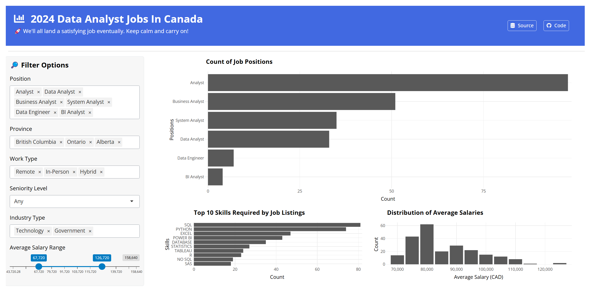

# Analytica 2024: Insights into the Canadian Data Analyst Job Market



## Motivation

**Target audience**: Data job seekers and data enthusiasts

Finding a data analyst job in Canada can be overwhelming, with so many positions, required skills, and salary expectations. As an international graduate student about to complete my Data Science degree, I know firsthand how challenging the Canadian job market can be.

That's why I developed this dashboard. It provides insights into the Canadian data analyst job market in 2024. By exploring data from the previous year, users can understand which positions were most common, which skills were most in demand, and how salaries varied across provinces and industries.

The goal is to help job seekers gain a better understanding of the landscape they are stepping into, allowing them to focus their efforts on roles that align with their skills and aspirations. By learning from the past, users can make more strategic decisions and prepare themselves better for the competitive job market.

## App Description

The 2024 Data Analyst Jobs in Canada Dashboard allows users to:

- Filter job listings by position, province, work type, seniority level, industry type, and average salary range.
- Visualize the distribution of job positions, top required skills, and salary ranges through interactive charts.
- Explore detailed job listings in a dynamic and searchable table format.
- Gain insights into the most demanded skills and the average salaries offered in various data analyst roles.

## Installation Instructions

1. Clone the repository:

   ```bash
   git clone https://github.com/Arc-Celt/analytica-2024.git
   cd analytica-2024
   ```

2. Install dependencies using renv:

   ```bash
   Rscript -e 'renv::restore()'
   ```

3. Run the app locally:

   ```bash
   Rscript app.R
   ```

4. Access the dashboard by opening the URL shown in the console output.

## License

This project was created by Archer Liu. It is licensed under the terms of the [MIT](https://github.com/Arc-Celt/analytica-2024/blob/main/LICENSE.md) license.
